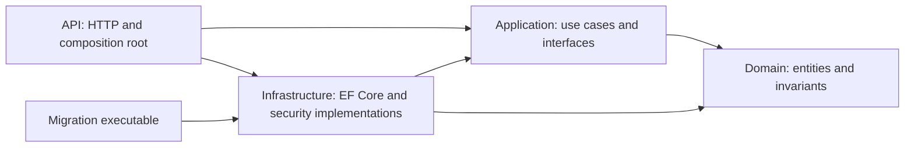

# TaskFlow

[](https://github.com/rodrigomoraisr/taskflow/actions/workflows/ci.yml)

A multi-tenant task management API built with .NET 10, PostgreSQL and Clean Architecture.

Users belong to one or more **workspaces**. A workspace owns projects, projects own
tasks, and every read and write is scoped to the caller's workspace membership and
role. Tenant-owned data is filtered by workspace at the repository boundary.
Authentication and the caller's workspace listing use account-scoped queries.

This is a portfolio project. It is deliberately over-invested in the parts that are
usually skipped — domain invariants, authorization, tenant isolation — and
deliberately under-invested elsewhere. Both are documented below.

---

## Live API and reviewer guide

The API runs on Azure App Service with Neon PostgreSQL:
[check liveness](https://taskflow-rodrigo-api-etgcbgg6a0bseybd.eastus-01.azurewebsites.net/health/live).
Health probes are public; workspace operations require a registered user's access
token and active membership. Use the local setup below for the guided examples.

- [API walkthrough and conventions](docs/API.md): registration, tokens, workspace,
  project, task, comments and activity.
- [Complete HTTP request collection](src/TaskFlow.Api/TaskFlow.Api.http): run requests
  individually and replace IDs/tokens with your own responses.
- [Architecture decisions](docs/adr/README.md): constraints, tradeoffs and supporting tests.
- [Deployment runbook](docs/deployment/azure.md): Key Vault, OIDC, migrations,
  release controls and recovery.

OpenAPI is available locally in Development at `/openapi/v1.json`, with endpoint
examples, response codes and bearer authentication metadata. The live deployment
does not expose that document or a Swagger UI. The health response proves
availability, not completion of an authenticated business flow.

## Running it

**Docker setup:** Docker with Compose v2. Use this to run the whole system without
installing the .NET SDK on your host.

```bash
cp .env.example .env
openssl rand -base64 48
# Paste the generated value into TASKFLOW_JWT_KEY in .env, then:
docker compose up --build -d --wait
curl http://localhost:8080/health/ready
```

Compose starts PostgreSQL, applies migrations through a separate command, and
starts the API only after that command succeeds. The API runs non-root in
Production mode on loopback HTTP port 8080; OpenAPI is disabled in this mode.
`.env` stays out of Git and Docker images. It is read by Compose, not by `dotnet run`.
If you already have the development database volume, keep its original password
(`postgres` in the original setup). Changing the environment value does not change
an existing database password.

```bash
docker compose logs api migrate
docker compose down       # Stops the stack; retains database data
```

Set `API_PORT`/`POSTGRES_PORT` in `.env` if host ports are occupied. Update the HTTP
collection's host address to `http://localhost:8080` when using Docker. This is a
local stack; the public deployment uses the verified HTTPS/proxy/secret setup in
the [Azure runbook](docs/deployment/azure.md).
See [ADR 0007](docs/adr/0007-container-runtime-and-migrations.md).

**Development with the SDK:** .NET 10 SDK and Docker for PostgreSQL. Use this for
editing/debugging the API and viewing its development OpenAPI document.

```bash
# 1. Start PostgreSQL
docker compose up -d postgres

# 2. Configure the JWT signing key (not committed — see Security below)
cd src/TaskFlow.Api
dotnet user-secrets init
dotnet user-secrets set "Jwt:Key" "$(openssl rand -base64 48)"

# 3. Apply migrations
dotnet ef database update --project ../TaskFlow.Infrastructure --startup-project .

# 4. Run
dotnet run
```

OpenAPI is exposed at `/openapi/v1.json` in Development.

```bash
# Tests — 541 of them; the integration suite starts a PostgreSQL container,
# so Docker must be running.
dotnet test

# Separate container smoke checks (Docker Compose, Python 3 and curl required)
# Creates and cleans up an isolated database; leaves the development volume alone.
bash scripts/smoke-containers.sh
```

---

## Architecture

Four projects, with dependencies pointing inward. `TaskFlow.Domain` references
nothing.

`TaskFlow.Migrator` is a separate deployment executable referencing Infrastructure;
it applies migrations without booting the API or requiring a signing key.



Arrows represent project references, not request flow. `Infrastructure` implements
Application's interfaces; the API wires implementations through dependency
injection. Nothing depends on `Api`. A request passes through HTTP middleware,
service authorization, a repository query and a unit-of-work commit. Domain code
does not know about HTTP or PostgreSQL.

### Domain model

| Entity | Notes |
| --- | --- |
| `User` | Email is unique. Passwords hashed with BCrypt. |
| `Workspace` | The tenant boundary. Soft-deleted. |
| `WorkspaceUser` | Membership join with a `WorkspaceRole`. Last owner cannot be removed or demoted. |
| `Project` | Belongs to exactly one workspace. Soft-deleted. |
| `Comment` | Author-owned task discussion, soft-deleted, maximum 2,000 characters. |
| `TaskActivity` | Append-only task/comment history with actor and timestamp. |
| `TaskItem` | Belongs to a workspace and a project. Status transitions are enforced, not assigned. |

Entities have private setters and a private parameterless constructor for EF Core.
State changes go through methods (`Start`, `Complete`, `Reopen`, `AssignTo`,
`Unassign`, `UpdateDetails`, `Delete`), each of which validates the transition and
throws a domain exception if it is illegal. There is no path to an invalid entity
through the public surface.

### Endpoints

```
POST   /auth/register
POST   /auth/login
POST   /auth/refresh
POST   /auth/logout

POST   /api/workspaces
GET    /api/workspaces
GET    /api/workspaces/{id}
DELETE /api/workspaces/{id}

GET    /api/workspaces/{workspaceId}/members
POST   /api/workspaces/{workspaceId}/members
PATCH  /api/workspaces/{workspaceId}/members/{userId}/role
DELETE /api/workspaces/{workspaceId}/members/{userId}

POST   /api/workspaces/{workspaceId}/projects
GET    /api/workspaces/{workspaceId}/projects
GET    /api/workspaces/{workspaceId}/projects/{projectId}
PUT    /api/workspaces/{workspaceId}/projects/{projectId}
DELETE /api/workspaces/{workspaceId}/projects/{projectId}

POST   /api/workspaces/{workspaceId}/tasks
GET    /api/workspaces/{workspaceId}/tasks          (paginated)
GET    /api/workspaces/{workspaceId}/tasks/{id}
PUT    /api/workspaces/{workspaceId}/tasks/{id}
DELETE /api/workspaces/{workspaceId}/tasks/{id}
POST   /api/workspaces/{workspaceId}/tasks/{id}/start
POST   /api/workspaces/{workspaceId}/tasks/{id}/complete
POST   /api/workspaces/{workspaceId}/tasks/{id}/reopen
PUT    /api/workspaces/{workspaceId}/tasks/{id}/assignee
DELETE /api/workspaces/{workspaceId}/tasks/{id}/assignee
```

Task listing supports combined filters and explicit sorting. For example:

```http
GET /api/workspaces/{workspaceId}/tasks?status=InProgress&priority=High&unassigned=true&sortBy=dueDate&sortDirection=asc&page=1&pageSize=20
```

Additional filters: `assigneeUserId`, `projectId`, `dueDateFrom`, `dueDateTo`.
Date bounds are inclusive UTC instants (send ISO 8601 with `Z` or an offset), not
whole-day ranges. Every supplied filter must match; `unassigned=true` cannot be
combined with `assigneeUserId`. Invalid filters return 400.

Sort fields: `createdAt`, `updatedAt`, `title`, `priority`, `status`, `dueDate`.
The default remains newest-created first. Null dates sort last, status uses workflow
order, and task ID breaks ties. `totalCount` uses the same filters as `items`, before
paging. See [ADR 0004](docs/adr/0004-task-query-contract.md) for semantics and the
concurrency limits of offset pagination.

Comments and task activity:

```text
POST   /api/workspaces/{workspaceId}/tasks/{taskId}/comments
GET    /api/workspaces/{workspaceId}/tasks/{taskId}/comments?page=1&pageSize=20
GET    /api/workspaces/{workspaceId}/tasks/{taskId}/comments/{id}
PUT    /api/workspaces/{workspaceId}/tasks/{taskId}/comments/{id}
DELETE /api/workspaces/{workspaceId}/tasks/{taskId}/comments/{id}
GET    /api/workspaces/{workspaceId}/activity?taskId={taskId}&page=1&pageSize=20
```

Comment create/edit bodies use `{ "body": "Ready for review" }`. Members, Admins
and Owners may create comments, but only the author may edit/delete one; Viewers
can read. Comment lists are oldest first, activity newest first; both return arrays
and cap page size at 100. `taskId` is optional on the workspace activity feed.
Activity `details` is a JSON-encoded string containing task before/after snapshots;
comment entries use an empty object and a comment ID, without copying comment text.

Task changes and activity entries commit together. History retains deleted tasks,
while their comments become inaccessible. Existing tasks have no fabricated history:
recording begins when the feature is deployed. Apply the new EF migration before
running the updated API. See [ADR 0003](docs/adr/0003-comments-and-task-activity.md)
for authorization, transaction, retention and append-only guarantees.

Business endpoints under `/api/*` require a bearer token. `/auth/*`, health probes,
and the development-only OpenAPI document are anonymous.

---

## Decisions

**Workspace id lives in the route, not in the token.** A token proves who you are;
it does not decide which tenant a request touches. Putting the workspace in the
route means every request is explicit about its tenant, and the authorization
service resolves the caller's role in *that* workspace on every call. A workspace
claim baked into the token would go stale the moment someone's role changed.

**Tenant isolation is enforced at the repository, not the service.** Repository
methods take a `workspaceId` and filter on it. A service that forgets to check
authorization is a bug; a repository that cannot express a cross-tenant query is a
design. The two layers are belt and braces on the same invariant.

**A non-member gets 404, not 403.** If you are not a member of a workspace, every
route under it answers exactly as though that workspace did not exist — same status,
same body. A 403 would confirm the workspace is real, which lets an outsider probe for
tenants by id. 403 is reserved for a caller who *is* a member but whose role does not
permit the action; that caller already knows the workspace exists, so the precise
answer costs nothing. The two cases stay distinct inside the application
(`UnauthorizedWorkspaceAccessException` versus `InsufficientWorkspaceRoleException`)
and are collapsed at the HTTP boundary in `ExceptionMiddleware`.

**Authorization happens before anything is loaded.** A method that loads the
entity and then checks permission returns exactly the same response as one that
checks first, so no test going through HTTP can tell them apart — which is why
the ordering drifts. It matters anyway: loading first fetches a row on behalf of
someone with no right to it, and makes the cost of a refusal depend on whether
the row exists, which is a timing signal sitting behind a 404 that is otherwise
careful to say nothing. Audited across all 21 workspace-scoped service methods
in [`docs/adr/0002`](docs/adr/0002-check-before-load.md), with the single
structural exception documented there rather than quietly tolerated.

**Status transitions are methods, not a settable property.** `task.Status = Done`
would let a caller skip validation. `task.Complete()` cannot — it checks the current
state and throws `InvalidTaskStatusTransitionException` if the move is illegal. The
rule lives with the data it constrains.

**Soft delete over hard delete.** Tasks and projects carry `IsDeleted` and
`DeletedAt`. Deleted entities reject further modification rather than silently
accepting it. This is the right default for anything a user might want restored, and
it keeps referential history intact.

**Repository + Unit of Work over `DbContext` in services.** The services never see
EF Core. `IUnitOfWork.SaveChangesAsync` makes the transaction boundary explicit and
visible at the call site instead of implicit in a framework type.

**Separate domain and application exceptions.** `InvalidTaskStatusTransitionException`
is a domain rule; `UnauthorizedWorkspaceAccessException` is an application concern.
The middleware maps both to status codes, but the layering stays honest.

**`CancellationToken` threaded end to end.** Every async method takes one and passes
it down. A client that disconnects should not leave a query running.

---

## Tests

541 tests across three projects, mirroring the layers.

| Project | Count | What it covers |
| --- | --- | --- |
| `TaskFlow.Domain.Tests` | 129 | Entity invariants, every status transition, guards on soft-deleted entities — one test per mutating method rather than one representative test |
| `TaskFlow.Application.Tests` | 147 | Service orchestration with substituted repositories and the **real** authorization services, plus the check-before-load audit |
| `TaskFlow.Api.IntegrationTests` | 265 | Tenant isolation over real HTTP, repository filters, database constraints, lifecycle journeys, comments/activity, task queries, authentication races/lockouts, signing-key validation, trusted proxy handling, bounded proxy diagnostics, correlated errors, health checks, rate limits, concurrency rollback, concurrent owner changes and generated OpenAPI contracts |

The lifecycle journey registers and logs in a user, creates a new workspace,
project and task, then starts, completes and reopens the task. Each transition
is verified through an API read and a fresh database context. A separate test
proves that starting an already started task returns 409 without changing its
stored status or update timestamp.

Integration tests run against PostgreSQL in Testcontainers, not the in-memory
provider — the in-memory provider does not enforce constraints, so a tenant
isolation bug the database would reject could pass in memory.

**The authorization services are never substituted.** Repositories,
`IUnitOfWork` and `ICurrentUser` are, but `WorkspaceAuthorizationService` and
`TaskAuthorizationService` are the real types in every test. Substituting them
would leave every role and tenant assertion passing against an authorization
service that returned `Owner` for everyone.

**Each suite is checked for its ability to fail.** A passing test proves nothing
about its strength, so the invariants are deliberately broken and the resulting
failures counted — the tables in [`docs/adr/0001`](docs/adr/0001-tenant-boundary-responses.md)
and [`docs/adr/0002`](docs/adr/0002-check-before-load.md) record which breaks
turn which tests red, and why the count matters. That exercise is what found the
real gap in the previous suite: the repository's `workspaceId` filter was
load-bearing and guarded by a single test, because every other cross-tenant
scenario was caught earlier by the membership check.

---

## Security

**The JWT signing key is not in source control.** It comes from user secrets in
development and from environment configuration elsewhere. `appsettings.json` declares
the `Jwt` section without a `Key` value; the app will fail to start if the key is
missing, which is the correct behaviour.

> An earlier commit in this repository's history contained a development-only signing
> key. It has been removed from the current tree and is not used anywhere. It was
> never a production secret.

Access JWTs last 15 minutes by default, with issuer, audience, lifetime, signing-key
and algorithm checks and zero clock skew. Login also returns a random refresh token
and `refreshTokenExpiresAt`. Refresh sessions last seven days without sliding expiry.

`POST /auth/refresh` and `POST /auth/logout` take
`{ "refreshToken": "<token returned by login>" }`. Every successful refresh returns
new access/refresh tokens; replace the stored token and serialize refresh calls.
Reusing an old token revokes that login session. Logout revokes its refresh session
but existing access JWTs remain valid until their signed expiry. Tokens are sent in
JSON bodies and auth responses are marked `no-store`. Use HTTPS when deployed and
never log credentials. Only SHA-256 refresh-token hashes are stored in PostgreSQL.

Five failed passwords lock new logins for 15 minutes; counters persist in PostgreSQL.
All auth endpoints share a 20-request/minute limit per remote IP, per instance,
returning 429 and Retry-After. `AuthRateLimit:PermitLimit` and
`AuthRateLimit:WindowSeconds` configure it. Arbitrary forwarding headers are ignored;
a trusted reverse proxy needs explicit configuration before deployment.

New passwords require at least 15 Unicode characters, at most 72 UTF-8 bytes, and
no control characters. BCrypt is retained, with no silent truncation or composition
rules. Existing shorter passwords can still log in. Unknown, inactive, locked and
wrong-password login attempts return the same generic 401; registration retains
its duplicate-email 409 behavior. Unhandled errors do not expose exception text.

Apply the new `AddRefreshSessionsAndLoginLockout` migration before running the
updated API. No migration creates credentials for existing accounts: log in to
start a refresh session. See [ADR 0005](docs/adr/0005-authentication-sessions-and-abuse-controls.md)
for transaction/locking behavior, race semantics and operational limitations.

---

## Operations and conflict handling

Responses include `X-Correlation-ID`. Send your own ID (1–64 ASCII letters, digits,
dots, underscores or hyphens) to connect a client report with the JSON console logs.
Errors now use `application/problem+json`: read `detail` instead of the old `error`
field, with `errors` for validation failures. Unexpected 500 details stay in logs.

`GET /health/live` checks that the process can respond. `GET /health/ready` checks
database connectivity and returns 503 if unavailable. Probes are anonymous and
remain available when rate limits are exhausted. A global per-IP limit of 120
requests/minute applies across application routes, in addition to the stricter
auth limit. Configure it under `GlobalRateLimit`; 429 responses include `Retry-After`.
Limits are per instance and do not trust arbitrary forwarding headers.

Task/project saves use PostgreSQL `xmin` for optimistic concurrency. A competing
write between load and save produces 409 and rolls back accompanying task activity.
Reload and review before resubmitting. Apply `AddTaskAndProjectConcurrency` through
the normal migration command; PostgreSQL already owns the underlying system column.
See [ADR 0006](docs/adr/0006-observability-hardening-and-concurrency.md) for the error
contract, tests and limits of this design.

---

## Deliberately left out

These are decisions, not omissions.

- **MFA, recovery and distributed abuse controls.** Password reset, email verification,
  breached-password checks, all-device logout and distributed rate limits remain
  outside this phase. Expired refresh-session cleanup also needs an operational job.
- **Client version preconditions and comment concurrency.** Task/project tokens
  protect overlapping server writes. Detecting an old edit form needs a client
  version contract such as `If-Match`; comment edits still use last-write-wins.
- **Centralized telemetry.** JSON console logs are available, but log shipping,
  metrics, distributed tracing and alerting remain deployment work.
- **A frontend.** This is an API. The HTTP collection in
  `src/TaskFlow.Api/TaskFlow.Api.http` and the notes in `docs/` are how it gets
  exercised by hand.
- **Search and file attachments.** Outside the current scope.

---

## Release status

The sixteen-phase portfolio scope is complete. See the
[`v1.0.0` release notes](docs/releases/v1.0.0.md),
[final audit](docs/FINAL-AUDIT.md) and [roadmap](docs/ROADMAP.md).

Shared build settings enforce warnings as errors, .NET 10 analyzers and direct/
transitive NuGet auditing in local, CI and container builds. The final review also
closed a concurrent last-owner removal/demotion race. Tag publication runs CI and
publishes images; production rollout remains an explicit workflow run against main.

---

## Tech

.NET 10 · ASP.NET Core · EF Core 10 · PostgreSQL 17 · Npgsql · xUnit ·
BCrypt.Net · JWT bearer authentication · Docker Compose
